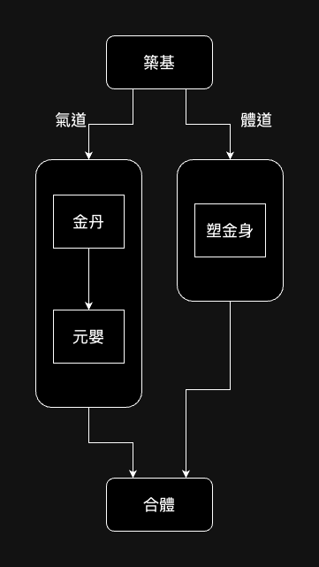
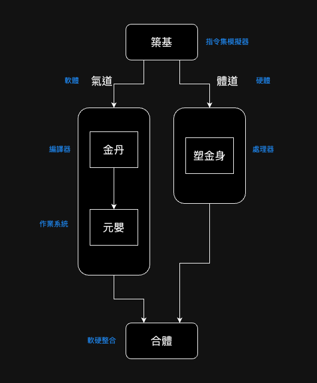

# 大品天仙訣之臆想

貧道閒暇之時，好覽開源碼，於年前嘗見「[大品天仙訣](https://github.com/immortal-formula/immortal-formula)」，頗有感觸，亦期待作者再更，可惜，經旬累月，無消無息。

轉念一想，或許「大品天仙訣」早已是成品也說不定，著訣前輩刻意僅寫就百餘字的總訣，指明修真離塵之綱要，而具體內容則留待道友共同補完。

思及此處，貧道心頭一熱，憶起早年蓬萊修行，派中良師寥寥，益友難尋，縱有勇猛精進之心，終究事倍功半，作詩一首，暫且按下不表：

> 少日曾懷凌雲志，欲就神術探源頭。煉氣十年出鄉里，泊舟萬里到帝州。一國精英齊聚首，六載光陰盡發朽。出得蓬門滿涕淚，已是人間第九流。

畢業矣，方悟得法、財、侶、地缺一不可，欲再從頭是不可能了，然而今日洽逢良機，發奮著同人書，若能裨益道友修行之「法」，乃至識得同修之「侶」，吾心甚慰。

## 總訣用語風格

總訣原文可見於[此處](https://github.com/immortal-formula/immortal-formula)，不再複述。原文是在試圖提出一種學習計算機科學的法門，其行文風格偏向文言文，但夾雜許多現代用語，欲仿古卻畫虎不成反類犬，這固然有著訣前輩古文功底不夠的成分，拖不了關係的還有：當今計算機科學源於西方，引入華夏後，諸多術語難以凝練漢語表示，

而前輩顯然察覺到了這個問題，甚至提出了自己的一套解決方法：引進修道、修仙的用語，重載其語義來適配計算機科學，這些用語似乎未必出自道家典籍，還雜揉了網路小說的設定。如此用語，是難以與從英語直譯過來的術語一一對應，然而細思又覺巧妙，若計算機科學濫觴於漢地，其用語本就該與今日大相徑庭，並與漢字結合更加緊密，入詩詞歌賦都會簡易得多。

## 總訣註疏

總訣提出的法門實則是可分爲兩條路子，一是氣道，一是體道。修道之初（築基），應當理解並實作氣、體之間的區別與介面，再來分別學習氣、體兩道，最終將兩道合而爲一，就等於自己從無到有構造了一台計算機。以下是圖解：

每個方框都代表一個境界，境界是還有標準的，以通行之術語解釋：

- 築基：選擇一種真言（指令集），實作其軟體模擬器，類似於自己實作 spike/qemu/nemu ，以對該真言有足夠理解，並方便驗證後續氣道、體道修為。
- 金丹：自定義一種咒（程式語言），撰寫其編譯器。
- 元嬰：以金丹期定義之咒，撰寫作業系統。
- 塑金身：以硬體語言寫個處理器。著訣前輩許是軟體背景，對此著墨甚淺。
- 合體：在自幹的處理器上跑自幹的系統、應用。

道友看到此處，想必也明白本作名之為「試結丹」之用意了！
