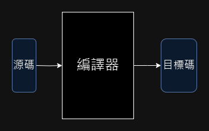
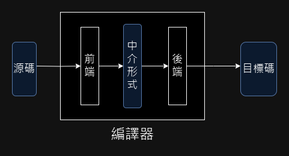
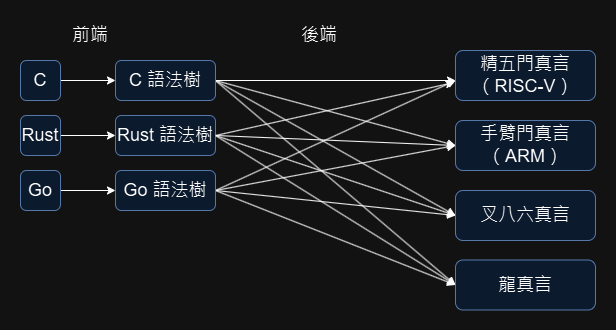
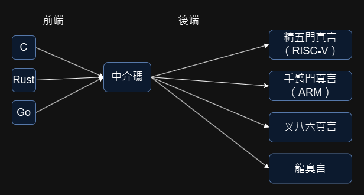
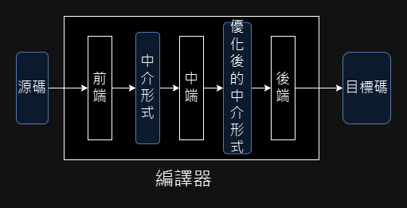
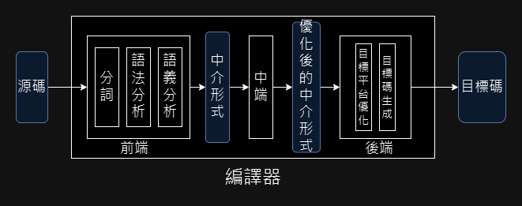

以最宏觀的角度來看，編譯器是程序，輸入源碼，輸出目標碼。

而當輸出是高階語言時，通常稱為轉譯。當此一程序輸出的是機器碼，或是很低階、很類似機器碼的虛擬機碼（如 JVM bytecode、webassembly），稱之為編譯器。

輸入跟輸出也有可能是同一個語言，常見的例如 JavaScript 的源碼混淆器（醜化器）、體積優化器。

本作僅關注於編譯器，故接下來將編譯器的內部繼續展開介紹，一般來說，編譯器能簡單拆分成前端跟後端。

## 編譯器的前後端

這張圖中可以看到，在源碼跟目標碼兩種格式之中，硬生生插入了一個中介形式出來，這個中介形式通常是抽象語法樹，或是某種接近機器碼，但以比特定機器碼更有結構的中介碼，最知名的例子就是 LLVM IR。

為什麼一定要有這個中介形式呢？如果是目標碼只有一種的編譯器，很可能不會有生出中介碼的步驟，而是直接從語法樹就變出機器語言了。此時生成語法樹之前叫前端，語法樹之後叫後端，就只是約定俗成的稱呼罷了，大致象徵著編譯程序已經把源碼轉換成有結構的形式，接下來就是優化跟生成目的碼了。

然而，當源碼跟目標碼不只一種時，中介形式的存在能省去大量的重複工作。

若不採用中介形式，如上圖所示，M 種源碼、 N 種目標，硬要獨立寫編譯器，可以寫出 M * N 個後端出來。

先把 M 種源碼都編譯到中介形式，再從中介形式生成目標碼，就可以不用重複寫後端生成目標碼的部分了。

## 編譯器前中後端

雖然程式語言語義各不相同，但到了中介形式這層，有大量的優化手段是通用的，例如死碼消除、常數摺疊，幾乎對所有主流語言都有益處。有道友將此一通用優化稱之為中端，如此就將編譯器分成了三層。

這三層的內部都可以再拆分，下圖再將前端和後端多拆分了幾層。

下一章會從前端開始細說。
