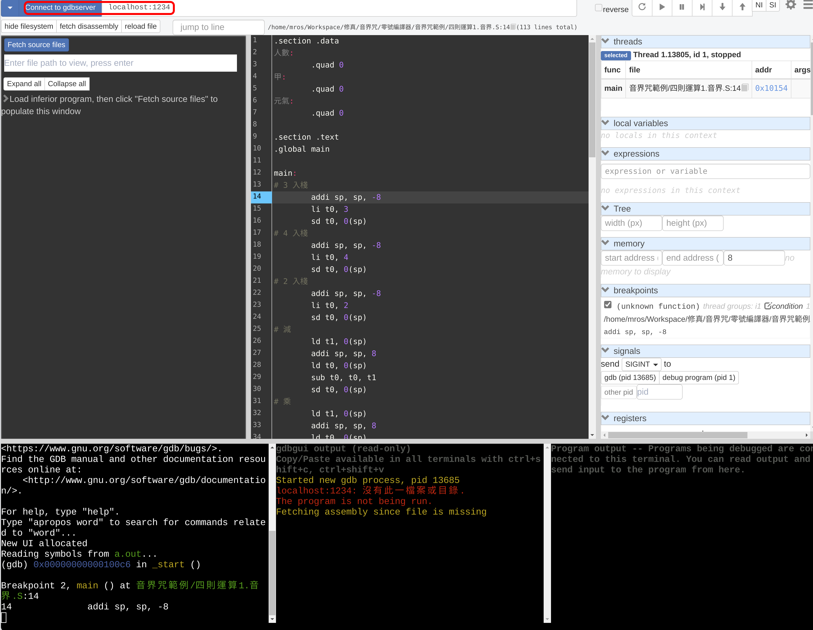

編譯器開發到了後端，可以開始生成目的碼（精五組語）之後，就得常常去除精五組語的錯。組語雖然已經十分接近真言的機器碼，但仍然要經過組譯、鏈結兩階段才會變成執行檔，在這兩階段發生：

- 偽真言（偽指令）被編成一到多條真言
- 生成 .section 所宣告的記憶體佈局
- 若依賴 libc ，會自動插入一初始化環境用的 `_start` 函數，再跳躍到 `main` 函數
- ...

由於組語跟執行檔仍舊存在這些隔閡，在對精五組譯器不是滾瓜爛熟，要用眼睛盯出到底何處爆出段異常（segmentation fault）可是困難重重，這時藉助除錯器（debugger）來逐步執行真言、隨時觀察記憶體跟暫存器的值，會讓工作輕鬆許多。

## qemu-riscv 啟用 gdb 伺服器

要想在除錯時保留原本組語檔案的資訊（如行號、原偽指令），需要在編譯時加上額外參數 `-g`：

```sh
riscv64-unknown-elf-gcc -g 範例.音界
```

若一份精五真言檔已經以交叉編譯器編譯出執行檔 `a.out`，可以用

```sh
# 1234 是 gdb 伺服器的監聽埠口，可選任意埠口
qemu-riscv64 -g 1234 a.out
```

來在 qemu 內開啟 gdb 伺服器，此時 qemu 會掛住終端，等候客戶端連線。

## gdb-multiarch 連上 qemu

打開另一個終端，輸入

```
gdb-multiarch a.out # 讀取 a.out 的符號資訊
```

會進入到一個互動式介面，這時輸入

```
target remote localhost:1234
```

就能連上 qemu 的 gdb 伺服器，開始除錯了。若對 gdb 不熟悉，可以在網路上搜尋相關介紹。


`gdb-multiarch` 可以自動偵測架構，用起來比較方便，若道友日常使用的系統中無此程式，需要找出交叉編譯工具鏈裡的 gdb ，可能是 `riscv64-unknown-elf-gdb`。

## 圖形介面：gdbgui
[gdbgui](https://www.gdbgui.com/) 是一個用 Web 技術製作的 gdb 圖形介面，它良好包裝了 gdb 客戶端的互動式指令，十分簡單易用。

`gdbgui` 可以接上一個參數 `--gdb-cmd` 來指定它要互動的 gdb 客戶端，如想接上吾人此處所用的 `gdb-multiarch`，可執行：

```sh
gdbgui --gdb-cmd 'gdb-multiarch a.out'
```

`gdbgui` 會自動開啟一個瀏覽器分頁，分頁上方輸入框設定好埠口為 `localhost:123` 後， 點擊分頁左上角 `Connect to gdbserver`，就能連上 qemu 的 gdbserver 了。截圖如下：



## 圖形界面：其他
照理說 vscode 內建的除錯器應該也能透過設定來支援精五真言，但貧道始終設定不來...TODO
