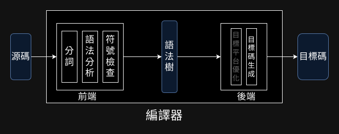
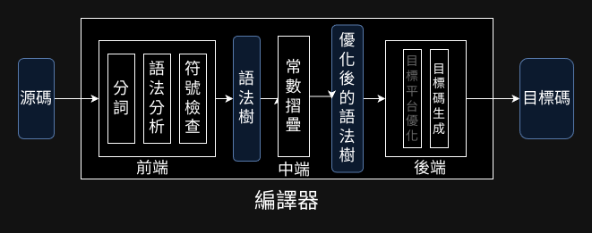

上圖展示了當前零．一版音界咒編譯器的各個部件。（除了目的平臺優化，在圖片中淡化）

本章節將介紹零．一版編譯器的最後一步：優化。完成後，全部件如下圖：



語法樹在實質上扮演了中間碼的角色，優化器輸入語法樹，輸出還是語法樹。這樣一來，優化階段後端完全不需要改。要在命令行指定是否優化也很容易，打開優化參數時，額外應用優化器即可，其餘流程照舊。

## 常數折疊

常數折疊是零．一版音界咒唯一也究極的優化了。

零．一版音界咒沒有使用者輸入、沒有亂數，它的輸出自然是一成不變的，這意味著，編譯器應當有能力在編譯期就計算好輸出。

```音界
元・甲＝３＊（４－２）＋５     # 計算出甲 = 11
元・乙＝１＋（１＋３）＊４     # 計算出乙 = 15
甲＊乙                     # 計算出結果是 11 * 15 = 165
```

在零．一版音界咒做到這件事相當容易，核心概念是維護一張符號表，記錄各個變數當前的值。

遍歷語法樹，遇到`變數宣告式`，求出要賦予給變數的值，寫入符號表；在算式中遇到變數，則去符號表中擷取當前變數值。

### 實作

```rust
pub fn 常數折疊(語法樹: Ｏ語法樹) -> Ｏ語法樹 {
    let mut 環境 = HashMap::<String, i64>::new();

    let mut 答案: i64 = 0;

    for 句 in 語法樹.句 {
        match 句 {
            Ｏ句::變數宣告(變數宣告) => {
                let 算式值 = 求值(&環境, &變數宣告.算式);
                答案 = 算式值;
                環境.insert(變數宣告.變數名, 算式值);
            }
            Ｏ句::算式(算式) => {
                答案 = 求值(&環境, &算式);
            }
        }
    }

    // 優化到語法樹裡只剩一個`算式`
    Ｏ語法樹 {
        句: vec![Ｏ句::算式(Ｏ算式::數字(答案))],
    }
}

fn 求值(環境: &HashMap<String, i64>, 算式: &Ｏ算式) -> i64 {
    match 算式 {
        Ｏ算式::數字(數) => *數,
        Ｏ算式::變數(變數) => *環境.get(變數).unwrap(),
        Ｏ算式::二元運算(運算) => {
            let 左值 = 求值(環境, 運算.左.as_ref());
            let 右值 = 求值(環境, 運算.右.as_ref());
            match 運算.運算子 {
                Ｏ運算子::加 => 左值 + 右值,
                Ｏ運算子::減 => 左值 - 右值,
                Ｏ運算子::乘 => 左值 * 右值,
                Ｏ運算子::除 => 左值 / 右值,
            }
        }
    }
}

```
