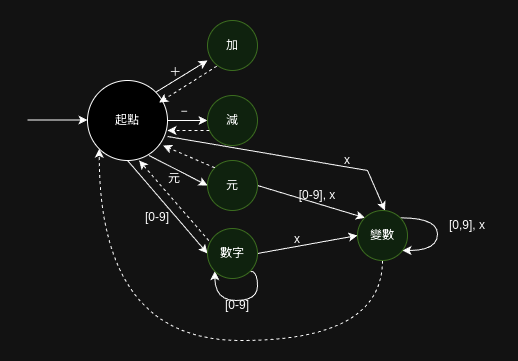

是什麼構成一篇漢語文章的呢？從小到大列舉，最小單位是「字」（通常狀況不會再去拆部首），「字」組成「詞」，「詞」再組成「句」，「句」組成「段落」，「段落」組成「文章」。

計算機要處理漢語時，第一步通常就是「分詞」，例如說 `嫉妒使我面目全非` ，可以拆解成「嫉妒」、「使」、「我」、「面目」、「全」、「非」。也許有人會把「面目全非」直接分一個詞，也不能說錯，自然語言本就沒必要只能唯一拆解。

法咒（程式語言）跟自然語言仍是有些共通之處，同樣能拆解成不同層級。

想像編譯器讀取音界咒文件時，它看見的是一個又一個的字元，而分詞器做的事情就很接近上述的漢語分詞器。但法咒（程式語言）不能有岐義，因此需要藉助特殊符號，如空白鍵或音界號來確定詞與詞之間的邊界。

來看個範例：

```音界
元．人數＝（１１＋３）＊４
人數＋１
```

第一行 `元．人數＝（１＋３）＊４` 依序是分解為

1. `元`，關鍵字「元」
2. `．`，音界號
3. `人數`，這是個變數
4. `＝`，等號
5. `（`，左括號
6. `１１`，數字
7. `＋`，運算子「加」
8. `３`，數字
9. `）`，右括號
10. `＊`，運算子「乘」
11. `４`，數字
12. `\n`，換行

而第二行 `人數＋１` 依序是

1. `人數`，這是個變數
2. `＋`，運算子「加」
3. `１`，數字
4. `\n`，換行

## 定義

下表羅列了零・一版音界咒的所有詞：
| 詞           | 種類  | 細分含義 |
| ----------- | --- | ---- |
| 元           | 關鍵字 |    |
| （           | 左括號 |     |
|  ）          | 右括號 |     |
| ＋           | 運算子 | 加    |
| −           | 運算子 | 減    |
| ＊           | 運算子 | 乘    |
| ／           | 運算子 | 除    |
| ＝           | 等號  |      |
| ・           | 音界號 |      |
| \n           | 換行 |      |
| [０-９]+      | 數字  |      |
| 除以上詞之外的所有字串 | 變數  |      |

前幾項全是單字詞，要分出它們是再簡單不過，但最後兩種詞「數字」、「變數」就可能是多個字組成的了。

`[０-９]+` 是正規表達式，其意思是，字串由一到多個０１２３４５６７８９組成。

## 狀態機

上一節中變數的詞法定義並不清楚，例如，變數不可以是「元」，但能不能是「元氣」呢？變數能不能包含數字，像是「２號機」？若允許這樣的寬鬆定義，分詞會較為困難，當讀取到「元」時，並無法確定現在正在讀取「元」關鍵字，同時也可能只讀到「元氣」變數的開頭而已。同理，當讀到[０-９]時，無法判定正在讀取數字，還是某個變數的開頭。

但無妨，早已有成熟的演算法能應對這類複雜狀況，在零・一版的簡單狀況，倒也不必構思出通用算法才能分詞，只要仔細分析所有狀況就可以了。

為了方便後續表達，先令 x 代表除了單字詞、[０-９]之外，所有的字元集合。

當目前讀取到的字串是...

- 除了元之外的單字詞，亦即（）＋−＊／＝・ 
    - 讀取到一個字即可確定為詞
- 元
    - 可能是變數的前綴，當下一個字元屬於 x 或 [０－９] ，即確定該詞為變數
    - 當下個字元不是上述狀況時，是元關鍵字
- [０-９]+
    - 可能是變數的前綴，當下一個字元屬於 x ，即確定該詞為變數
    - 當下個字元不是上述狀況時，是數字
- x
    - 必是變數

下圖把上述分析畫成了狀態機，但該圖並沒有畫出所有單字詞，僅以加減為例，其餘單字詞請道友自行想像。



分詞器會不斷接收到字元，分詞器根據接收的字元維護自身狀態。初始狀態是「起點」，每接收到一個字元，就嘗試匹配實線，若無法匹配，就精油虛線回到原點，並且根據當下狀態分詞。

畫出狀態機之後，以法咒（程式語言）依樣畫葫蘆實作，就是件很容易的事了。

貧道採用 Rust 法咒來撰寫零版編譯器，以下展示其分詞器實作。

## 實作

### 類型定義

首先，寫出合適的類型來表達詞的種類：

```rust
// Rust 慣以駝峰式命名類型
// 漢語無大小寫，本作慣例以全形英文字母Ｏ來當類型的開頭
// Rust 管制識別符的字元組成，不允許 ◉、⦿、☯︎ 等等萬國碼，故採用常見的全形Ｏ來代替。
#[derive(Debug)]
enum Ｏ運算子 {
    加,
    減,
    乘,
    除,
}

#[derive(Debug)]
pub enum Ｏ詞 {
    元,
    左括號,
    右括號,
    運算子(Ｏ運算子),
    等,
    音界,
    數字(i64),
    變數(String),
}
```

接下來，就是把上圖的狀態機刻出來了，觀察狀態轉移的出邊，字符能分為四類，為此貧道寫了以下輔助函數備用：

```rust
enum Ｏ字類 {
    特殊符號,
    數字,
    元,
    其他, // 也就是 x
}

fn 字類(字: &char) -> Ｏ字類 {
    match 字 {
        '＋' | '－' | '＊' | '／' | '＝' | '（' | '）' | '・' | '\n' => {
            Ｏ字類::特殊符號
        }
        '元' => Ｏ字類::元,
        '１' | '２' | '３' | '４' | '５' | '６' | '７' | '８' | '９' | '０' => {
            Ｏ字類::數字
        }
        _ => Ｏ字類::其他,
    }
}
```

想模擬狀態機，最簡單的方法是：定義一個狀態變數，建好狀態轉移表。狀態機啟動時將狀態變數設為初始值，接下來根據接收到的字元，以及建好的表進行狀態轉移直到字元流結束。

貧道在此用了稍微不同的寫法，將每個狀態都以一個函式來表達（除了單字詞的情況太簡單，跟起點態的函數寫在一起），函式根據當前字元呼叫下個狀態函式。

這種寫法不用額外宣告一個變數當狀態，當下呼叫到哪個函式，狀態機的狀態就是該函式對應的狀態，也可以說狀態其實藏在函式調用棧裡。

```rust
pub struct Ｏ分詞器 {
    字流: VecDeque<char>,
}

impl Ｏ分詞器 {
    pub fn new(源碼: String) -> Self {
        Ｏ分詞器 {
            字流: 源碼.chars().collect(),
        }
    }

    fn 起點態(&mut self) -> Option<Ｏ詞> {
        let 字 = self.字流.pop_front()?;
        match 字 {
            '＋' => Some(Ｏ詞::運算子(Ｏ運算子::加)),
            '－' => Some(Ｏ詞::運算子(Ｏ運算子::減)),
            '＊' => Some(Ｏ詞::運算子(Ｏ運算子::乘)),
            '／' => Some(Ｏ詞::運算子(Ｏ運算子::除)),
            '＝' => Some(Ｏ詞::等),
            '（' => Some(Ｏ詞::左括號),
            '）' => Some(Ｏ詞::右括號),
            '・' => Some(Ｏ詞::音界),
            '\n' => Some(Ｏ詞::換行),
            '元' => self.元態(),
            '１' | '２' | '３' | '４' | '５' | '６' | '７' | '８' | '９' | '０' => {
                self.數字態(字.to_string())
            }
            _ => self.變數態(字.to_string()),
        }
    }
    fn 元態(&mut self) -> Option<Ｏ詞> {
        let 字 = self.字流.front()?;
        match 字類(字) {
            Ｏ字類::元 | Ｏ字類::數字 | Ｏ字類::其他 => {
                self.變數態("元".to_string())
            }
            _ => Some(Ｏ詞::元),
        }
    }
    fn 數字態(&mut self, mut 前綴: String) -> Option<Ｏ詞> {
        let 字 = self.字流.front()?;
        match 字類(字) {
            Ｏ字類::數字 => {
                前綴.push(self.字流.pop_front()?);
                self.數字態(前綴)
            }
            Ｏ字類::其他 => {
                前綴.push(self.字流.pop_front()?);
                self.變數態(前綴)
            }
            _ => {
                let 數 = crate::全形處理::數字::字串轉整數(&前綴);
                Some(Ｏ詞::數字(數))
            }
        }
    }
    fn 變數態(&mut self, mut 前綴: String) -> Option<Ｏ詞> {
        let 字 = self.字流.front()?;
        match 字類(字) {
            Ｏ字類::元 | Ｏ字類::數字 | Ｏ字類::其他 => {
                前綴.push(self.字流.pop_front()?);
                self.變數態(前綴)
            }
            _ => Some(Ｏ詞::變數(前綴)),
        }
    }

    pub fn 分詞(mut self) -> Vec<Ｏ詞> {
        let mut 詞列: Vec<Ｏ詞> = Vec::new();
        while self.字流.front().is_some() {
            match self.起點態() {
                Some(詞) => {
                    詞列.push(詞);
                }
                None => {
                    panic!("分詞錯誤");
                }
            }
        }
        詞列
    }
}
```
