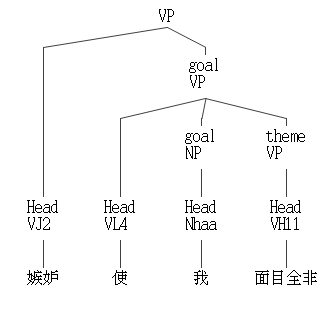
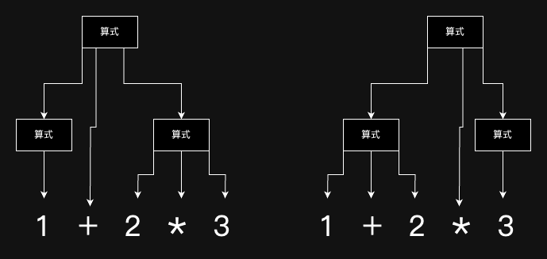

繼續觀察漢語「嫉妒使我面目全非」，分詞後得到「嫉妒」、「使」、「我」、「面目全非」。接下來，我們試著了解這些詞是如何組成一個句子的，這樣的組成是否合乎語法，試分析其句型，「嫉妒使我面目全非」在現代漢語中屬於「使」字句，其可拆解為：

名詞・**使**・名詞・形容詞

或可寫成：

主語・**使**・賓語・形容詞。

得到句型拆解後，可以依樣造句（有如小學作業），例如：

> 我面目的劇變使眾人心驚膽顫

注意到主語、形容詞未必是個單詞，也可以是多詞複合，如「我面目的巨變」還可以拆解成「我」「面目」「的」「劇變」。

這代表主語作為句子的一部分並非最小單位，還可以向下拆分：
```
主語 = 名詞 | 形容詞・名詞 | 名詞・的・名詞 | ...
```

漢語有非常多句型，以下列出幾個常見的：

- 主語・動詞
    - 時光・逝去
- 主語・動詞・受詞
    -  武林盟・滅・唐門
- 主語・形容詞
    -  小明・天下無敵

想用有限句型就完全涵蓋漢語是幾乎不可能的，自然語言的語法剖析器存在於人們的腦子裡，無法強行一致，教育也只是儘量這些腦剖析器能大致相通。人的語言靈活多變，即使到了本世紀仍可能誕生新的句型、語法，而新語法誕生後，也不可能在一瞬間普及到每個人的腦子裡。學界一直在研究如何盡可能做好自然語言的剖析，雖然不可能完美，但已有許多具實用價值的成品，如中研院開發的[中文剖析器線上測試](https://parser.iis.sinica.edu.tw/)，號稱能解析六萬多種句子結構，用它來剖析本文開頭的例句可得：




## 法咒的語法定義

雖然不可能讓所有人腦子裡的語法剖析器完全相同，但讓所有人電腦裡的剖析器版本相同倒是有可能的，至少版本不同的時候可以強迫用戶更新！而且法咒的語法是人造的，能在創造之初就定義好法咒的語法，而非如自然語言一般只能事後歸納。

貧道現在就來定義零・一版音界咒的語法，回到範例：

```音界
元．人數＝（１１＋３）＊４
人數＋１
```

音界咒只有兩種句型，一是變數宣告式，一是算式，這兩種句型可以穿插出現，其（上下文無關）語法定義可寫為：

```語法
音界咒 = 句 | 句・音界咒
句 = 變數宣告式 | 算式
```

第一個語法式 `音界咒 = 句 | 句・音界咒` 定義了一個音界咒檔案該有的樣子，它可以是 `句`，也可以是 `句・音界咒`，此處的「・」代表`句`之後緊接著`音界咒`，由於左側跟右側皆有「音界咒」，因此這是個遞迴定義，意指`音界咒`可分解為`句・音界咒`，而`句・音界咒`又可再分解為`句・句・音界咒`，一直到無窮個`句・句・句・句・句...`都是合法的音界咒。

語法式`句 = 變數宣告式 | 算式`，則近一步定義了句的樣貌，其有兩種型態，可以是`變數宣告式`，也可以是`算式`，變數宣告式很容易，只有一種可能：

```語法
變數宣告式 = "元"・"・"・變數・"＝"・算式
```

算式則較為複雜，敏銳的道友可能已經注意到，算式也蘊含了遞回。

```語法
算式 = 變數
    | 數字
    | "（"・算式・"）"
    | 算式・運算子・算式
運算子 = "＋" | "−" | "＊" | "／"
```
`算式`可以只是一個變數或數字，`算式・運算子・算式`表明`算式`也可以是加減乘除的結果，`"（"・算式・"）"`，而在算式兩側加上括號後，依然是合法括號，也就是說，`１＋２`是`算式`，而`(１＋２)`、`((１＋２))`、`(((１＋２)))`...也都是合法算式，`０`、`（０）`、`（（０））`也都合法。


思考題：有沒有辦法定義上下文無關語法，把同一層級的括號限制在一對，禁止`((１＋２))`、`(((１＋２)))`之無意義括號？

為方便觀看，以下將音界咒零・一版全部語法定義縮排後寫在一起，並加入一條`音界咒檔 = 音界咒・檔案結尾`，以生成檔案結尾（EOF）而完整描述音界咒檔案。

```語法
音界咒檔 = 音界咒・檔案結尾

音界咒     = 句
          | 句・音界咒

句        = 變數宣告式
          | 算式

變數宣告式 = "元"・"・"・變數・"＝"・算式

算式      = 變數
         | 數字
         | "（"・算式・"）"
         | 算式・運算子・算式

運算子    = "＋"
         | "−"
         | "＊"
         | "／"
```

## 語法歧義
前文寫出的語法定義，定義的是如何**生成**合乎語法的字串，而非如何將字串的語法**剖析**出來。

這意思是說，當吾人想生成出所有（長度小於 n）的`算式`時，可以遍歷`算式`的兩個分支得到`變數宣告式`、`算式`兩種語法，這兩種語法又可以繼續分支下去，如此遞迴，便能得出所有（長度小於 n）的`算式`。

但是在遞迴遍歷的過程中，不同路徑很可能會造出重複的句子。

以`１＋２＊３`為例，其生成方式可能是`算式` => `算式＋算式` => `算式＋算式＊算式`，先以`＋`展開，接著展開後的第二個再以`＊`展開，也可能是`算式` => `算式＊算式` => `算式＋算式＊算式`，初始算式先以`＊`展開，展開後的第二個算式再以`＋`展開，如圖：



一種語法出現不同展開過程但同結果這種情況，該語法就是「有歧義的」，亦有人稱「模糊」、「模稜兩可」、「二義性」。

歧義是一項不良性質，若對上圖中得到的兩棵語法樹做後序運算求值，所得將會不相同，一個是先乘除後加減，另個則是先加減後乘除。

即使語法存在歧義，還是有辦法剖析的，舉個例子，透過回溯來得到所有可能的語法樹，再依照某種方式挑選，如此還是能用一套算法總是從一套源碼中得到相同的語法樹。

遇到歧義與法時，也可以嘗試直接修原語法定義，寫出一套無歧義的語法。`算式`的例子可以透過額外增加`乘除式`、`原子式`兩層級來迫使先乘除後加減：

```
算式   = 乘除式
      | 算式・＋・乘除式
      | 算式・−・乘除式
乘除式 = 原子式
      | 乘除式・＊・原子式
      | 乘除式・／・原子式
原子式 = 數字
      | 變數
      | "（"・算式・"）"
```

## 回溯剖析

再整理一次音界咒語法。

```語法
音界咒檔 = 音界咒・檔案結尾

音界咒     = 句
          | 句・音界咒

句        = 變數宣告式
          | 算式

變數宣告式 = "元"・"・"・變數・"＝"・算式

算式   = 乘除式
      | 算式・＋・乘除式
      | 算式・−・乘除式

乘除式 = 原子式
      | 乘除式・＊・原子式
      | 乘除式・／・原子式

原子式 = 數字
      | 變數
      | "（"・算式・"）"
```

前文提到，有了語法規則定義，就能透過遞迴展開生成符（生成符，即在語法規則左側出現，還能繼續展開的符號），最終獲得所有長度小於 n 的展開式。

當吾人想要剖析時，也能利用這個想法，若一份文本長度為 n ，那遞迴生成出所有長度等於 n 的展開式，並一一與原始碼做比對，比到一種展開是一模一樣的，檢視當下的展開過程，就能得到語法樹了。

一直展開到長度 n 才比對，太浪費時間了，一發現當下的展開式已經跟文本不一樣，就可以放棄目前展開，回溯到上個還沒失敗的狀態。

寫成虛擬碼如下：

``` 音界
// 「剖析」函式嘗試以「展開式」來生成「文本」

「文本」為一全域變數

剖析（展開式）-> 成功｜失敗：
    匹配展開式與文本，若相等，回傳成功

    首生成符 = 展開式中的第一個生成符
    
    遍歷首生成符的「生成規則」 {
        新展開式 = 在原展開式中，以「生成規則」展開首生成符
        若「新展開式」的前綴已與文本不同，嘗試下個規則

        若「剖析（新展開式）」成功，回傳成功
    }

    走到這裡表示所有規則都不行，回傳失敗

// 初始展開式僅為「音界咒檔」
剖析（音界咒檔）
```

以上虛擬碼為求簡單，省略了許多優化，例如說，首生成符的位置跟目前比對無誤的文本位置都應該紀錄起來，不用每次都從頭比對。另外，編譯器應用中，剖析應回傳語法樹，而非單單成功或失敗。

## 消除左遞迴

注意到`剖析（展開式）`是遞迴函式，它會嘗試以各種規則展開首生成符，然後繼繻呼叫`剖析（新展開式）`。

觀察`剖析（算式）`，只要第一個規則`算式 = 乘除式` 配對失敗，就會嘗試匹配`算式 = 算式・＋・乘除式`，也就是呼叫`剖析（算式・＋・乘除式）`，此一規則並沒有消耗任何文本，第一個規則剛剛不能生效，此刻一樣不能生效，於是會再套用一次`算式 = 算式・＋・乘除式`得到`剖析（算式・＋・乘除式・＋・乘除式）`......如此落入無窮遞迴。

若保證每個展開都能消耗掉至少一個字符，就能避免落入遞迴，但文本卻完全不變的狀況。再次改寫算式：

其中 e 代表空字串。

```
算式      = 乘除式・重複乘除式

重複乘除式 = ＋・重複乘除式
         | −・重複乘除式
         | e

乘除式    = 原子式・重複原子式

重複原子式 = ＊・重複乘除式
         | ／・重複乘除式
         | e

原子式    = 數字
         | 變數
         | "（"・算式・"）"
```

算式被改寫了真多次，由此可見寫出易於剖析的語法不是一件易事。所幸，這是零・一版最後一次重寫語法了。
