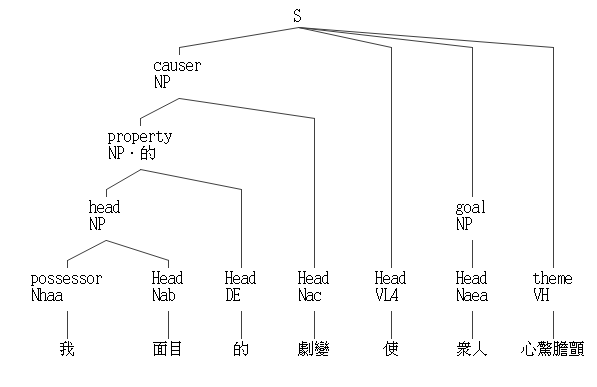

繼續觀察漢語「嫉妒使我面目全非」，分詞後得到「嫉妒」、「使」、「我」、「面目全非」。接下來，我們試著了解這些詞是如何組成一個句子的，這樣的組成是否合乎語法，試分析其句型，「嫉妒使我面目全非」在現代漢語中屬於「使」字句，其可拆解為：

名詞・**使**・名詞・形容詞

或可寫成：

主語・**使**・賓語・形容詞。

得到句型拆解後，可以依樣造句（有如小學作業），例如：

> 我面目的劇變使眾人心驚膽顫

注意到主語、形容詞未必是個單詞，也可以是多詞複合，如「我面目的巨變」還可以拆解成「我」「面目」「的」「劇變」。

這代表主語作為句子的一部分並非最小單位，還可以向下拆分：
```
主語 = 名詞 | 形容詞・名詞 | 名詞・的・名詞 | ...
```

漢語有非常多句型，以下列出幾個常見的：

- 主語・動詞
    - 時光・逝去
- 主語・動詞・受詞
    -  武林盟・滅・唐門
- 主語・形容詞
    -  小明・天下無敵

想用有限句型就完全涵蓋漢語是幾乎不可能的，自然語言的語法剖析器存在於人們的腦子裡，無法強行一致，教育也只是儘量這些腦剖析器能大致相通。人的語言靈活多變，即使到了本世紀仍可能誕生新的句型、語法，而新語法誕生後，也不可能在一瞬間普及到每個人的腦子裡。學界一直在研究如何盡可能做好自然語言的剖析，雖然不可能完美，但已有許多具實用價值的成品，如中研院開發的[中文剖析器線上測試](https://parser.iis.sinica.edu.tw/)，號稱能解析六萬多種句子結構，用它來剖析本文開頭的例句可得：




## 法咒的語法定義

雖然不可能讓所有人腦子裡的語法剖析器完全相同，但讓所有人電腦裡的剖析器版本相同倒是有可能的，至少版本不同的時候可以強迫用戶更新！而且法咒的語法是人造的，能在創造之初就定義好法咒的語法，而非如自然語言一般只能事後歸納。

貧道現在就來定義零・一版音界咒的語法，回到範例：

```音界
元．人數＝（１１＋３）＊４
人數＋１
```

音界咒只有兩種句型，一是變數宣告式，一是算式，這兩種句型可以穿插出現，其（上下文無關）語法定義可寫為：

```語法
音界咒 = 句 | 句・音界咒
句 = 變數宣告式 | 算式
```

第一個語法式 `音界咒 = 句 | 句・音界咒` 定義了一個音界咒檔案該有的樣子，它可以是 `句`，也可以是 `句・音界咒`，此處的「・」代表`句`之後緊接著`音界咒`，由於左側跟右側皆有「音界咒」，因此這是個遞迴定義，意指`音界咒`可分解為`句・音界咒`，而`句・音界咒`又可再分解為`句・句・音界咒`，一直到無窮個`句・句・句・句・句...`都是合法的音界咒。

語法式`句 = 變數宣告式 | 算式`，則近一步定義了句的樣貌，其有兩種型態，可以是`變數宣告式`，也可以是`算式`，變數宣告式很容易，只有一種可能：

```語法
變數宣告式 = "元"・"・"・變數・"＝"・算式
```

算式則較為複雜，敏銳的道友可能已經注意到，算式也蘊含了遞回，。

```語法
算式 = 運算元・運算子・運算元 | "（"・算式・"）"
運算元 = 變數 | 數字 | 算式
運算子 = "＋" | "−" | "＊" | "／"
```
`算式 = 運算元・運算子・運算元 | "("・算式・")"`將`算式`定義為`運算元・運算子・運算元`，而在算式兩側加上括號後，依然是合法括號，也就是說，`１＋２`是`算式`，而`(１＋２)`、`((１＋２))`、`(((１＋２)))`...也都是合法算式。


思考題：有沒有辦法定義上下文無關語法，把同一層級的括號限制在一對，禁止`((１＋２))`、`(((１＋２)))`之無意義括號？
