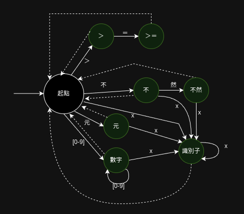

欲再做分詞，需先細數零．二版加入了哪些新詞。

運算子方面，有：
- ％
- ＝＝
- ！＝
- ＞
- ＞＝
- ＜
- ＜＝

特殊符號有：
- 【
- 】

關鍵字則有：
- 術
- 若
- 或若
- 不然
- 歸

若不以功能性區分，以詞固有的性質來區分：
運算子與特殊符號用到的符號都不允許出現在識別子（變數名、術名），可以歸為一類討論。其中，長度為 1 的詞有可能恰為長度為 2 的詞的前綴，此狀況需要特殊判定。其餘 1 字詞判定與＋－＊／處理方式相同。

關鍵字中的 1 字詞處理方式與零．一版的`元`相同，2 字詞與 1 字詞也類似，只是會增加一個狀態。

回憶零．一版的分詞狀態機：

以此為基礎繪製零．二版的分詞狀態機，貧道略去 1 字特殊符號的狀態，而 1 字關鍵字僅以`元`為代表，並以`不然`為 2 字關鍵字之代表，`＞＝`與`＞`為前綴問題之代表。

此外，除變數名之外，術名也允許非特殊符字符任意組合，今統一稱此二者為`識別子`。

新圖中`x`的含義與零．一版並不相同，其意義改變為「其他出邊字符之外的所有非特殊字符」。
TODO: 修改零．一版分詞狀態圖，使 x 之意義相同。

本次分詞就不再附上代碼，在零．一版的基礎上依狀態機畫葫蘆即可得。
