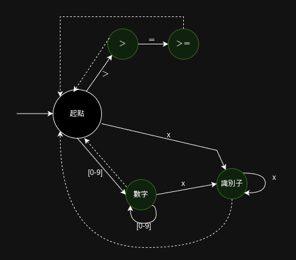

欲再做分詞，需先細數零．二版加入了哪些新詞。

## 新詞列表

運算子方面，有：
- ％
- ＝＝
- ！＝
- ＞
- ＞＝
- ＜
- ＜＝

特殊符號有：
- 【
- 】
- 、

關鍵字則有：
- 術
- 若
- 或若
- 不然
- 歸

若不以功能性區分，以詞固有的性質來區分：
運算子與特殊符號用到的符號都不允許出現在識別子（變數名、術名），可以歸為一類討論。其中，長度為 1 的詞有可能恰為長度為 2 的詞的前綴，此狀況需要特殊判定。其餘 1 字詞判定與＋－＊／處理方式相同。

關鍵字中的 1 字詞處理方式與零．一版的`元`相同，2 字詞與 1 字詞也類似，只是會增加一個狀態。

回憶零．一版的分詞狀態機：


以此為基礎繪製零．二版的分詞狀態機，貧道略去 1 字特殊符號的狀態，而 1 字關鍵字僅以`元`為代表，並以`不然`為 2 字關鍵字之代表，`＞＝`與`＞`為前綴問題之代表。

此外，除變數名之外，術名也允許非特殊符號、非數字任意組合，今統一稱此二者為`識別子`。


提醒：`x`的含義是「非數字、非特殊字符、非其他出邊字元的所有字元集合」。

把狀態機完整畫完，再在零．一版的分詞器源碼的基礎上依狀態機畫葫蘆即可寫出分詞器。

## 先將關鍵字當識別子

但若真的把整套狀態機畫出來，會發現頗為繁雜，關鍵字製造出太多狀態，其每個狀態有都類似，只要沒接收到預期後傳，馬上就轉換成識別子。

這其實昭示關鍵字與識別子的關係十分接近，那吾人不妨先將關鍵字當識別子，等識別子被斷詞後，再去判定該識別子的內容是否是某個關鍵字。

如此狀態機會簡單得多：



## 實作

零．二版開始有 2 字的特殊符號，但這不難處理，只要往前多看一個字元就能判斷：

``` rust
fn 起點態(&mut self) -> Option<Ｏ詞> {
    let 字 = self.字流.pop_front()?;
    match 字 {
        '＋' => Some(Ｏ詞::運算子(Ｏ運算子::加)),
        '－' => Some(Ｏ詞::運算子(Ｏ運算子::減)),
        '＊' => Some(Ｏ詞::運算子(Ｏ運算子::乘)),
        '／' => Some(Ｏ詞::運算子(Ｏ運算子::除)),
        '％' => Some(Ｏ詞::運算子(Ｏ運算子::餘)),
        '＝' => match self.字流.front() {
            Some('＝') => {
                self.字流.pop_front()?;
                Some(Ｏ詞::運算子(Ｏ運算子::等於))
            }
            _ => Some(Ｏ詞::賦值),
        },
        '！' => match self.字流.front() {
            Some('＝') => {
                self.字流.pop_front()?;
                Some(Ｏ詞::運算子(Ｏ運算子::異於))
            }
            _ => panic!("！後必接＝"),
        },
        '＜' => match self.字流.front() {
            Some('＝') => {
                self.字流.pop_front()?;
                Some(Ｏ詞::運算子(Ｏ運算子::小於等於))
            }
            _ => Some(Ｏ詞::運算子(Ｏ運算子::小於)),
        },
        '＞' => match self.字流.front() {
            Some('＝') => {
                self.字流.pop_front()?;
                Some(Ｏ詞::運算子(Ｏ運算子::大於等於))
            }
            _ => Some(Ｏ詞::運算子(Ｏ運算子::大於)),
        },
        '（' => Some(Ｏ詞::左圓括號),
        '）' => Some(Ｏ詞::右圓括號),
        '【' => Some(Ｏ詞::左基括號),
        '】' => Some(Ｏ詞::右基括號),
        '．' => Some(Ｏ詞::音界),
        '、' => Some(Ｏ詞::頓號),
        '\n' => Some(Ｏ詞::換行),
        '\t' | ' ' | '　' => Some(Ｏ詞::空白),
        '１' | '２' | '３' | '４' | '５' | '６' | '７' | '８' | '９' | '０' => {
            self.數字態(字.to_string())
        }
        _ => self.識別子態(字.to_string()),
    }
}
```

數字態實作維持不變，識別子態會在斷詞完成時，判定其內容是否恰為一關鍵字：

```rust
fn 識別子態(&mut self, mut 前綴: String) -> Option<Ｏ詞> {
    let 字 = self.字流.front()?;
    match 字類(字) {
        Ｏ字類::數字 | Ｏ字類::其他 => {
            前綴.push(self.字流.pop_front()?);
            self.識別子態(前綴)
        }
        Ｏ字類::特殊符號 => {
            // 遇到特殊符號，識別子截止
            // 判定是否是關鍵字
            match 前綴.as_str() {
                "元" => Some(Ｏ詞::元),
                "術" => Some(Ｏ詞::術),
                "歸" => Some(Ｏ詞::歸),
                "若" => Some(Ｏ詞::若),
                "或若" => Some(Ｏ詞::或若),
                "不然" => Some(Ｏ詞::不然),
                _ => Some(Ｏ詞::識別子(前綴)),
            }
        }
    }
}
```

