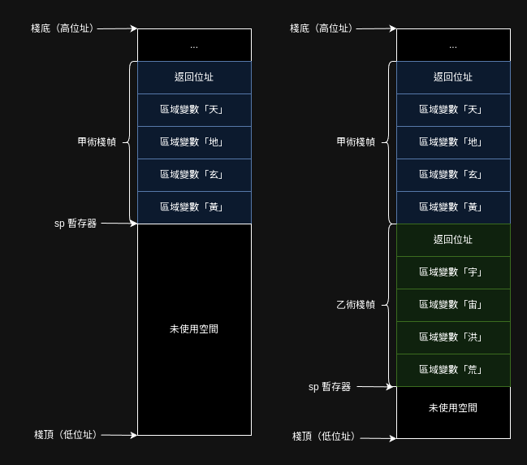
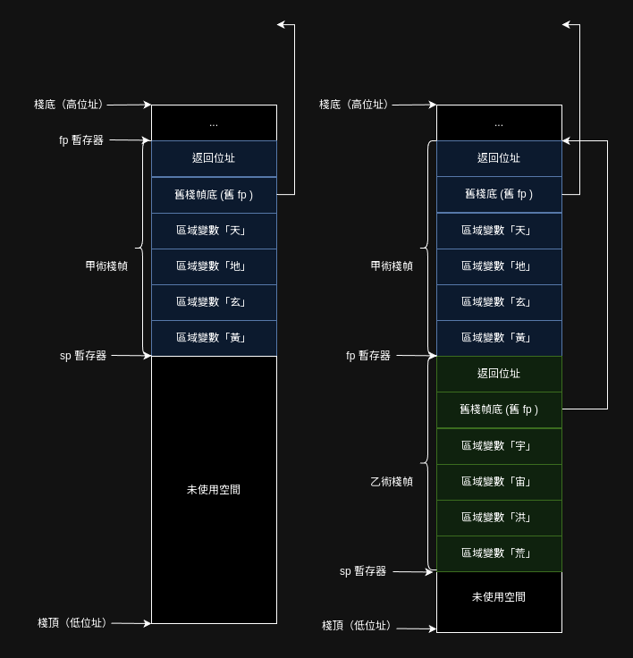

執行檔所定義的事情，不外乎**數據如何存放**與**程式如何執行**。

在零．一版中，所有的變數都是全域變數，程式執行也是一行一行往下。

但零．二版引入了術之後，一切都變了，術內宣告的變數都是區域變數；而程式碼在施術後會跳到另一個術裡執行，完成後又回到原本的術裡。

## 棧與術

由於在咒執行的過程中，一個術可能被施展多次，最簡單的例子就是遞迴術，術中有術，層層嵌套。由於執行次數可能取決於法咒的輸入，編譯器無法知曉究竟一個術在法咒執行過程中究竟會執行幾次，因此不可能在編譯期就將記憶體分配完。

那只好在執行期動態分配記憶體了，分配到哪裡呢？[老樣子](../零．一版/精五真言生成.md)，放到棧上，畢竟術的施展天然就像棧這種資料結構。

```音界
術．甲（）【

    元．天＝１
    元．地＝１
    元．玄＝１
    元．黃＝１

    乙（）
】
術．乙（）【

    元．宇＝１
    元．宙＝１
    元．洪＝１
    元．荒＝１

    曰（宇＋宙＋洪＋荒） // 曰是外術（外部函式）
】
```

以下分別圖示剛施展甲術，以及甲術呼叫乙術之後的棧的樣子。

圖左為剛施展甲術，未施展乙術；圖右為甲術施展乙術後：



圖中的區域變數對應甲、乙術中宣告的變數，很直觀能理解。但每個術在棧中還額外佔用了一塊空間「返回位址」，這是做什麼的呢？

當計算機執行術時，會將計算機的咒指針（program counter）指向術的開頭，隨著咒指針遞增，術就一行行執行下去了，當甲術執行到要施展乙術後，乙必須先記錄當下的施者（caller）——也就是甲——施術時的咒指針，在乙術結束時，才能夠再跳回甲施乙術後的下一條真言執行。

### 臨時變數
注意到`乙`術的最後一行 `曰（宇＋宙＋洪＋荒）` ，回憶在[零．一版](../零．一版/精五真言生成.md)中，計算算式時，吾人會將計算機當成一個堆疊機來用，在棧上開出更多空間以存放計算的中間結果。

這就意味著單純採用堆疊機，且不進行優化，是沒法僅在棧中開四個變數的空間就完成計算。

這有幾種不同的作法：

#### 編譯器計算出臨時變數需要的空間
例如，編譯器能夠直接計算出需要幾個臨時變數，例如可以將原`乙`術在中間碼就轉換成如下邏輯

```
術．乙（）【

    元．宇＝１
    元．宙＝１
    元．洪＝１
    元．荒＝１

    元．和1＝宇＋宙
    元．和2＝洪＋荒
    元．和＝和1＋和2

    曰（和）
】
```
則可以配出七個整數的空間。（此非最優解）

#### 棧動態增長
也可以如零．一版一樣，一邊計算一邊把臨時結果壓入棧，實作可能簡單一些。但最終仍要把棧恢復到舊貌，也就是說仍然要記錄棧到底增長了多少，或者採用 `fp` 暫存器來記錄當下的棧底為多少。

使用 `fp` 的棧會形如：



但無論如何，臨時增長棧就意味著修改 `sp`，在執行期改暫存器會造成額外開銷，因此在實務中不太會採用這種策略。

gcc 可以用 `-fomit-frame-pointer` 來調控是否採用 `fp` 的棧形式，`fp`在棧中構成一個鏈結串列，故採用 `fp` 能輕鬆的追蹤施術鏈（函式調用鏈）。

方便除錯也是設計 `fp` 的主要目的，只是剛好用了它能讓實作棧動態增長變得容易些罷了。

不過要計算臨時變數也挺麻煩，先以記錄 `fp` 的方式來實作施術吧。

## 術的真言形式

來看看上述的甲、乙兩術翻成真言會是什麼樣子：

