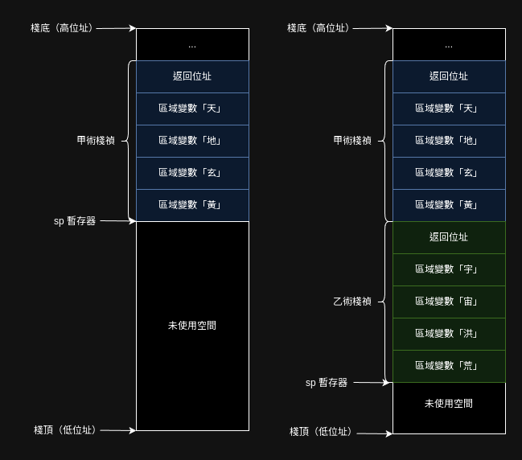
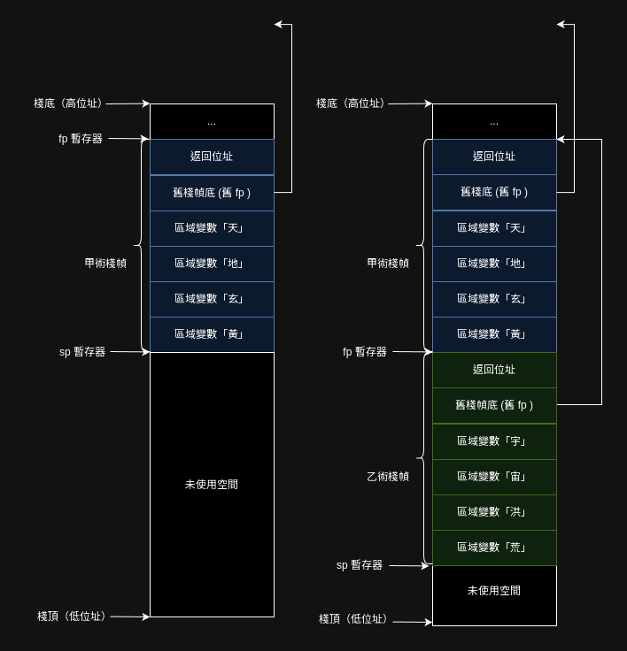

執行檔所定義的事情，不外乎**數據如何存放**與**程式如何執行**。

在零．一版中，所有的變數都是全域變數，程式執行也是一行一行往下。

但零．二版引入了術之後，一切都變了，術內宣告的變數都是區域變數；而程式碼在施術後會跳到另一個術裡執行，完成後又回到原本的術裡。

## 區域變數

咒執行的過程中，一個術可能被施展多次，最簡單的例子就是遞迴術，術中有術，層層嵌套。由於執行次數可能取決於法咒的輸入，編譯器無法知曉一個術在法咒執行過程中究竟會執行幾次，因此不可能在編譯期就將術中區域變數的記憶體分配完。

那只好在執行期動態分配記憶體了，分配到哪裡呢？[老樣子](../零．一版/精五真言生成.md)，放到棧上，畢竟術的施展天然就像棧這種資料結構。

```音界
術．甲（）【

    元．天＝１
    元．地＝１
    元．玄＝１
    元．黃＝１

    乙（）
】
術．乙（）【

    元．宇＝１
    元．宙＝１
    元．洪＝１
    元．荒＝１

    曰（宇＋宙＋洪＋荒） // 曰是外術（外部函式）
】
```

以下分別圖示剛施展甲術，以及甲術呼叫乙術之後的棧的樣子。

圖左為剛施展甲術，未施展乙術；圖右為甲術施展乙術後：



圖中的區域變數對應甲、乙術中宣告的變數，很直觀能理解。但每個術在棧中還額外佔用了一塊空間「返回位址」，這是做什麼的呢？

當計算機執行術時，會將計算機的咒指針（program counter）指向術的開頭，隨著咒指針遞增，術就一行行執行下去了，當甲術執行到要施展乙術後，乙必須先記錄當下的施者（caller）——也就是甲——施術時的咒指針，在乙術結束時，才能夠再跳回甲施乙術後的下一條真言執行。

## 臨時變數
注意到`乙`術的最後一行 `曰（宇＋宙＋洪＋荒）` ，回憶在[零．一版](../零．一版/精五真言生成.md)中，計算算式時，吾人會將計算機當成一個堆疊機來用，在棧上開出更多空間以存放計算的中間結果。

這就意味著單純採用堆疊機，且不進行優化，是沒法僅在棧中開四個變數的空間就完成計算。

這有幾種不同的作法：

### 編譯器計算出臨時變數需要的空間
例如，編譯器能夠直接計算出需要幾個臨時變數，例如可以將原`乙`術在中間碼就轉換成如下邏輯

```
術．乙（）【

    元．宇＝１
    元．宙＝１
    元．洪＝１
    元．荒＝１

    元．和1＝宇＋宙
    元．和2＝洪＋荒
    元．和＝和1＋和2

    曰（和）
】
```
則可以配出七個整數的空間。（此非最優解）

### 棧動態增長
也可以如零．一版一樣，一邊計算一邊把臨時結果壓入棧，實作可能簡單一些。但最終仍要把棧恢復到舊貌，也就是說仍然要記錄棧到底增長了多少，或者採用 `fp` 暫存器來記錄當下的棧底為多少。

臨時增長棧也會導致用 `sp` 來索引區域變數的位址會不太穩定，以 `fp` 來索引實作會比較容易。（棧臨時增長時，`sp`動，但`fp`不動）

使用 `fp` 的棧會形如：



但無論如何，臨時增長棧就意味著修改 `sp`，在執行期改暫存器會造成額外開銷，因此在實務中不太會採用這種策略。

gcc 可以用 `-fomit-frame-pointer` 來調控是否採用 `fp` 的棧形式，`fp`在棧中構成一個鏈結串列，故採用 `fp` 能輕鬆的追蹤施術鏈（函式調用鏈）。

方便除錯也是設計 `fp` 的主要目的，只是剛好用了它能讓實作棧動態增長變得容易些罷了。

不過要計算臨時變數也挺麻煩，先以記錄 `fp` 的方式來實作施術吧。

## 施術的真言形式

來看看上述的甲、乙兩術翻成真言會是什麼樣子：

```assembly
甲:
    # 四個區域變數＋返回位址＋舊 fp
    # 總共 6 * 8 位元組 （64 位元系統）
    addi sp, sp, -48
    # 儲存返回地址
    sd ra, 40(sp)      # ra = return address = 返回地址
    # 儲存舊棧底（fp）
    sd s0, 32(sp)      # s0 就是 fp
    # 更新 s0(fp) 為現在的棧底
    addi s0, sp, 48

    // 初始化區域變數
    li t0, 1             # t0 = 1
    sd t0, -24(s0)       # 元．天 = 1
    sd t0, -32(s0)       # 元．地 = 1
    sd t0, -40(s0)       # 元．玄 = 1
    sd t0, -48(s0)       # 元．黃 = 1

    call 乙              # jal ra, 術乙

    # 收尾
    ld ra, -8(s0)        # 恢復返回位址給暫存器 ra
    mv sp, s0            # 歸還棧空間
    ld s0, -16(s0)        # 恢復 fp
    ret                  # jr ra


乙:
    # 四個區域變數＋返回位址＋舊 fp
    # 總共 6 * 8 位元組 （64 位元系統）
    addi sp, sp, -48
    # 儲存返回地址
    sd ra, 40(sp)      # ra = return address = 返回地址
    # 儲存舊棧底（fp）
    sd s0, 32(sp)      # s0 就是 fp
    # 更新 s0(fp) 為現在的棧底
    addi s0, sp, 48

    // 初始化區域變數
    li t0, 1             # t0 = 1
    sd t0, -24(s0)        # 元．宇 = 1
    sd t0, -32(s0)        # 元．宙 = 1
    sd t0, -40(s0)        # 元．洪 = 1
    sd t0, -48(s0)        # 元．荒 = 1

    # 同零．一版用堆疊機來計算宇＋宙＋洪＋荒

    # 宇入棧
    addi sp, sp, -8
    ld t0, -24(s0)
    sd t0, 0(sp)

    # 宙入棧
    addi sp, sp, -8
    ld t0, -32(s0)
    sd t0, 0(sp)

    # 加
    ld t1, 0(sp)
	addi sp, sp, 8
	ld t0, 0(sp)
	add t0, t0, t1
	sd t0, 0(sp)

    # 洪入棧
    addi sp, sp, -8
    ld t0, -40(s0)
    sd t0, 0(sp)

    # 加
    ld t1, 0(sp)
	addi sp, sp, 8
	ld t0, 0(sp)
	add t0, t0, t1
	sd t0, 0(sp)

    # 荒入棧
    addi sp, sp, -8
    ld t0, -48(s0)
    sd t0, 0(sp)

    # 加
    ld t1, 0(sp)
	addi sp, sp, 8
	ld t0, 0(sp)
	add t0, t0, t1
	sd t0, 0(sp)

    # 答案在棧頂，將其載到 t1 暫存器
    ld t1, 0(sp)
    # 彈出計算結果後 sp 又回到術開始時的原本位置，棧大小恢復如初
	addi sp, sp, 8

    # 準備參數，施展外術「曰」
    mv a0, t1
    call 曰

    # 收尾
    ld ra, -8(s0)        # 恢復返回位址給暫存器 ra
    mv sp, s0            # 歸還棧空間
    ld s0, -16(s0)       # 恢復 fp
    ret                  # jr ra

```

再來看看乙那段將宇、宙、洪、荒相加的算式，若編譯器好好優化，會怎麽計算：

```assembly
// 初始化區域變數
lw t1, -8(s0)           # 「宇」載至t1
lw t2, -16(s0)          # 「宙」載至t1
lw t3, -24(s0)          # 「洪」載至t1
lw t4, -32(s0)          # 「荒」載至t1
add t5, t1, t2          # t5 = 宇 + 宙
add t5, t5, t3          # t5 = t5 + 洪
add t5, t5, t4          # t5 = t5 + 荒
```
全在暫存器就算完了。
