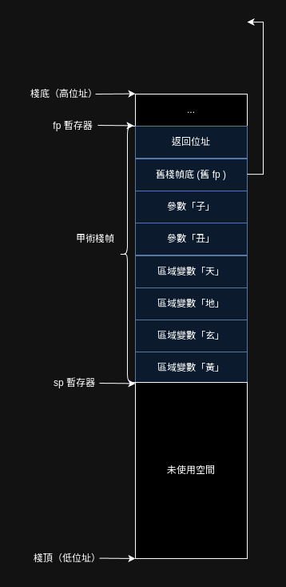

本章將結合實際程式碼來一觀術是如何被編譯的。

## 計算棧的大小

究竟要分配多大的棧空間給一個術呢？

```音界
術．甲（子、丑）【
    元．天＝１
    元．地＝１
    元．玄＝１
    元．黃＝１
】
```

再回顧這張圖：



兩個參數＋四個區域變數＋舊棧禎底＋返回位址，總共要 8 個字長，在 64 位元系統中，就是 8 * 64 = 256 位元，也就是 64 位元組。

### 考慮區塊

參數數量、舊棧禎底、返回位址需要的空間都是雷打不動，但若法咒中帶有區塊，區域變數的情況會稍微複雜一些：

```音界
術．甲（）【
    若（...）【
        元．天＝１
        元．地＝１
    】或若（...）【
        元．玄＝１
    】不然【
        元．黃＝１
    】
】
```

「若」語句可以有多分支，但僅有其中一支會執行，因此不需要為每一個分支中的區域變數都分配空間，分的空間夠用量最大的分支使用就好。在上例中，第一條分支有兩個區域變數，其餘分支都僅一個區域變數，那分配兩個整數的空間就足以應付了。

```音界
術．甲（）【
    若（...）【
        元．天＝１
        元．地＝１
    】

    // 做其他事

    若（...）【
        元．玄＝１
    】

    // 做其他事
    
    若（...）【
        元．黃＝１
    】
】
```
即使是獨立的幾個「若」語句也一樣，不同區塊內的區域變數的作用域不相同，不可能同時被使用，這個例子仍然只需要分配兩個整數的空間。

### 實作：計算需分配多少空間給區域變數
```rust
fn 區塊區域變數數量(區塊: &Vec<Ｏ句>) -> usize {
    let mut 頂層計數 = 0;
    let mut 塊內計數 = 0;

    for 句 in 區塊 {
        match 句 {
            Ｏ句::變數宣告(_) => {
                頂層計數 += 1;
            }
            Ｏ句::若(若) => 塊內計數 = max(塊內計數, 若區域變數數量(若)),
            _ => {}
        }
    }

    頂層計數 + 塊內計數
}

fn 若區域變數數量(若: &Ｏ若) -> usize {
    let mut 計數 = 區塊區域變數數量(&若.區塊);
    for 或若 in &若.或若列表 {
        計數 = max(計數, 區塊區域變數數量(&或若.區塊))
    }

    match &若.不然 {
        Some(Ｏ不然 { 區塊 }) => 計數 = max(計數, 區塊區域變數數量(&區塊)),
        None => {}
    }
    計數
}

pub fn 術內區域變數數量(術: &Ｏ術宣告) -> usize {
    區塊區域變數數量(&術.術體)
}
```

## 術開頭

計算棧的大小後，增長棧(修改`sp`)，推入返回地址與舊棧幀底`fp`後。

```rust
writeln!(真言檔, "{}:", 術.術名)?;

let 區域變數數量 = 術內區域變數數量(&術);

let 棧初始大小 = (術.形參.len() + 區域變數數量 + 2) * 字長;
// 增長棧
writeln!(真言檔, "\taddi sp, sp, -{}", 棧初始大小)?;
// 儲存返回地址
writeln!(真言檔, "\tsd ra, {}(sp)", 棧初始大小 - 字長)?;
// 儲存舊棧底（fp）
writeln!(真言檔, "\tsd s0, {}(sp)", 棧初始大小 - 字長 * 2)?;
// 更新 s0 為現在的棧底（s0 就是 fp）
writeln!(真言檔, "\taddi s0, sp, {}", 棧初始大小)
```

## 索引變數位址

當需要擷取變數，必須先知曉變數究竟是在棧中（參數或區域變數）還是在數據段（全域變數），才能夠生成正確的讀寫指令。

貧道在實作中以`Ｏ變數位址`來分辨變數所在何處：

```rust
#[derive(Clone, Copy, Display)]
enum Ｏ棧中類型 {
    區域變數,
    實參,
}
use Ｏ棧中類型::*;

#[derive(Clone, Copy)]
enum Ｏ變數位址 {
    全域,

    棧中(usize, Ｏ棧中類型),
}

impl Ｏ變數位址 {
    // 從記憶體載入暫存器中
    fn 載入(&self, 真言檔: &mut File, 暫存器名: &str, 變數名: &str) -> io::Result<()> {
        match self {
            Ｏ變數位址::全域 => {
                writeln!(真言檔, "# 載入全域變數「{}」", 變數名)?;
                writeln!(真言檔, "\tld {}, {}", 暫存器名, 變數名)
            }
            Ｏ變數位址::棧中(偏移, 棧中類型) => {
                writeln!(真言檔, "# 載入{}「{}」", 棧中類型, 變數名)?;
                writeln!(真言檔, "\tld {}, -{}(s0)", 暫存器名, 偏移)
            }
        }
    }

    // 從暫存器寫到記憶體
    fn 寫出(&self, 真言檔: &mut File, 暫存器名: &str, 變數名: &str) -> io::Result<()> {
        match self {
            Ｏ變數位址::全域 => {
                panic!("目前語法不會使全域變數的值被更改");
            }
            Ｏ變數位址::棧中(偏移, 棧中類型) => {
                writeln!(真言檔, "# 寫出{}「{}」", 棧中類型, 變數名)?;
                writeln!(真言檔, "\tsd {}, -{}(s0)", 暫存器名, 偏移)
            }
        }
    }
}
```
參數與區域變數都在棧中，其擷取方式一致。

### 記錄變數的棧中位址

以符號表來記錄各個變數的所在位置，注意到變數表是一個可持久化 Trie 樹雜湊表，那是因為在區塊中的區域變數可以覆蓋外部變數，但離開區塊之後，區塊內的變數又不再作用，故直接在進入區塊時生成變數表的不可變副本，是最容易的實作方式。

```rust
// 目前不支援術中術
// 符號檢查有通過的話，術一定都存在的，不需要記錄
#[derive(Clone)]
struct Ｏ符號表 {
    變數表: rpds::HashTrieMap<String, Ｏ變數位址>,
    計數: usize, // 當下術內有幾個實參跟區域變數
}

impl Ｏ符號表 {
    fn new() -> Self {
        Self {
            變數表: HashTrieMap::new(),
            計數: 1,
        }
    }
    fn 錄入全域變數(&mut self, 變數名: &String) {
        self.變數表.insert_mut(變數名.clone(), Ｏ變數位址::全域);
    }
    fn 錄入棧中變數(&mut self, 變數名: &String, 棧中類型: Ｏ棧中類型) {
        self.變數表.insert_mut(
            變數名.clone(),
            Ｏ變數位址::棧中(字長 * (self.計數 + 2), 棧中類型),
        );
        self.計數 += 1;
    }
    fn 取得變數位址(&self, 變數名: &String) -> Ｏ變數位址 {
        match self.變數表.get(變數名) {
            Some(變數位址) => *變數位址,
            None => {
                panic!(
                    "編譯器內部錯誤：未在符號檢查階段檢查到未宣告變數「{}」",
                    變數名
                )
            }
        }
    }
}
```

有了符號表，要記錄變數位址就很容易了，在頂層宣告遇到變數宣告，就將變數錄入全域，在術中遇到，就將變數錄入棧中。

至於參數要在術的開頭就記錄參數位址，並從參數暫存器寫入棧中。
```rust
// 將術的參數加入符號表
// 並將參數從 a0~a7 寫入棧中
for (編號, 參名) in 術.形參.iter().enumerate() {
    符號表.錄入棧中變數(參名, 實參);
    符號表
        .取得變數位址(參名)
        .寫出(真言檔, &format!("a{}", 編號), 參名)?;
}
```

## 計算

計算與零．一版保持一致，依然採用堆疊機，不管完成任何計算，棧會增加一個整數大小的空間，存放計算結果。如若用不到計算結果了，得記得將其彈出棧，以維護棧的大小。

```rust
// 計算結束時，棧頂 = t0 = 計算結果
fn 計算(
    真言檔: &mut File, 算式: &Ｏ算式, 符號表: &Ｏ符號表
) -> io::Result<()> {
    match 算式 {
        Ｏ算式::二元運算(二元運算) => {
            Self::計算(真言檔, 二元運算.左.as_ref(), 符號表)?;
            Self::計算(真言檔, 二元運算.右.as_ref(), 符號表)?;
            Self::二元運算(真言檔, &二元運算.運算子)
        }
        Ｏ算式::數字(數) => Self::數字入棧(真言檔, 數),
        Ｏ算式::變數(變數) => Self::變數入棧(真言檔, 變數, 符號表),
        Ｏ算式::施術(施術) => Self::施術(真言檔, 施術, 符號表),
    }
}
```

相比零．一版，此處增加了一種算式——`施術`，依然可用堆疊機來完成，先分別計算各個實參，將實參的值壓入棧中，等實參都計算完畢後，將實參值載入參數暫存器後，施術（call）。

### 計算施術
